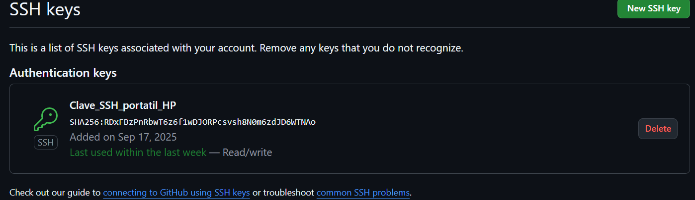

# Manual configurar github por ssh

## Instalación de la clave en Github

Para la instalación de la clave de Github, necesitamos generar una Clave y para generarla tenemos que escribir el siguiente código:

>ssh-keygen -t ed25519 -C "ianaltri@gmail.com"

Después de ejecutar el siguiente código crea dos claves, una pública y una privada.

```text
-----------------------------
-Clave privada-
> id_ed25519
> cat ~/.ssh/id_ed25519 -> Comando Clave Privada
-----------------------------
-Clave pública-
> id_ed25519.pub
> cat ~/.ssh/id_ed25519.pub -> Comando Clave Pública
-----------------------------
```
Una vez acabado esto, lo que hacemos es copiar la Clave pública para agregarla en github.
### Pasos para agregar la clave a github
```
1.- Entrar en github
2.- Una vez dentro pulsamos donde el icono de perfil
3.- En el menú desplegable seleccionamos "settings"
4.- Dentro de los ajustes buscamos un apartado donde ponga "SSH and GPG keys" y lo seleccionamos
5.- Ahora vamos al apartado de "SSH Keys" y pulsamos en "New SSH key"
6.- Seguidamente te saldrá un menú donde te pide introducir unos datos que son los siguientes:
    > Title --> Es para ponerle el nombre que quieras a la llave
    > Key Type --> Hay que elegir la opción "Authentication Key"
    > Key --> Es donde se introduce la clave pública
7.- Ahora cuando hayas acabado de rellenar todo, pulsas en "Add SSH key" y ya tendrías tu llave SSH
```



## Añadir la clave a Agent

Lo primero que tenemos que hacer es preparar la clave Agent que para poder hacer eso, necesitaremos ejecutar el siguiente comando:

>eval "$(ssh-agent -s)"

Una vez ejecutado ese comando, el siguiente paso es añadir la clave Agent y para eso tenemos que ejecutar un nuevo comando, per el caso es que este comando no ha terminado funcionado que el siguiente: 

>ssh-agent ~/.ssh/id_ed25519

Claro ahora viendo que este comando no funcionaba, lo que hemos hecho ha sido abrir PowerShell como administrador y ejecutar la siguiente serie de comandos para poder crear la clave Agent.

```
> Get-Service ssh-agent | Set-Service -StartupType Automatic
> Start-Service ssh-agent
> ssh-add C:\Users\ialva\.ssh\id_ed25519
```

## Verificar la clave

Ahora para verificar esta clave simplemente tenemos que ejecutar otro comando en el PowerShell que sale en la imagen anterior, el comando es el siguiente:

>ssh -T git@github.com

Una vez ejecutado ese comando, para saber si se ha realizado bien el proceso tenemos que recibir un mensaje como este:

>Hi Iann5! You've successfully authenticated, but GitHub does not provide shell access.
